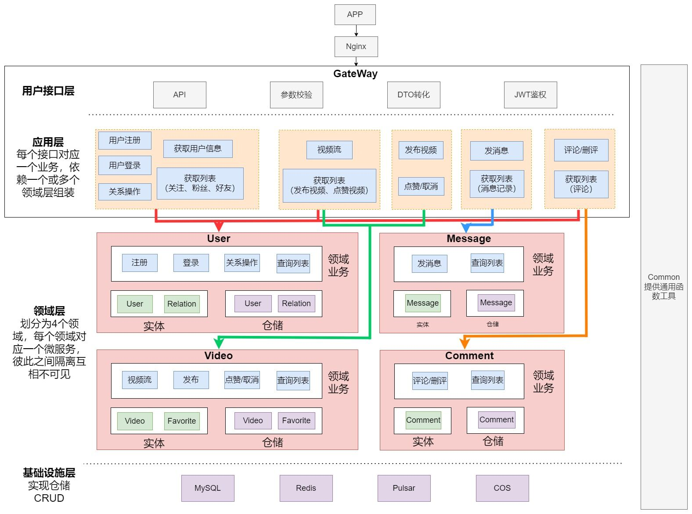

# 字节青训营douyin项目
## 项目文档
https://gzd0wrb2k4.feishu.cn/docx/TlUxdrUiOoT9E8xiN4Ocwhhpnig
## 项目架构图

本项目实现了极简版抖音后端的互动方向和社交方向全部功能，项目采用Kitex进行RPC通信，基于DDD思想划分微服务架构，合理拆解各项业务，便于团队协作开发，建立开发规范约束，使用Pulsar消息队列对其中的一些高频写操作进行异步处理，削峰处理提高系统并发和可用性；使用Otel和Jaeger实现链路追踪；采用MySQL、Redis存储配合的方式来提高性能，减少MySQL压力；通过Nginx限流、参数校验、存储加密、访问控制和登录次数限制等设计提高安全性；并且充分编写了单元测试，完成了集成测试和压力测试。